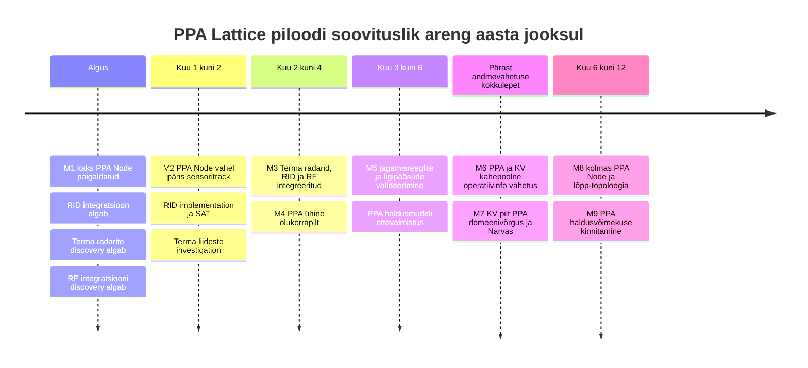

# PPA Lattice piloodi eesmärgid, etapid ja vahe-eesmärgid

## Kokkuvõte

PPA Lattice piloodi eesmärk on **valideerida Lattice kolme omavahel seotud võimekusena**: PPA olemasolevate sensorite ja süsteemide integratsiooniplatvormina, erinevatest allikatest saadava info ühise olukorrapildi platvormina ning kontrollitud kahepoolse operatiivinfo vahetuse vahendina PPA ja Kaitseväe vahel.

Piloodi lõppseisus on PPA keskkonnas **kolm Lattice Node**, mis võimaldavad PPA eri võrkudes paiknevaid andmeallikaid Lattice keskkonda tuua ning vahetada lubatud operatiivinfot otse Kaitseväe Lattice Node vahel. Esimeses etapis paigaldatakse kaks PPA Node. Need ühendatakse omavahel ning Kaitseväega suhtleb esialgu üks PPA Node. Selline etapistus võimaldab PPA tehnilist integratsiooni ja Node vahelise andmevahetuse tööd alustada enne PPA ja Kaitseväe andmevahetuse kokkuleppe lõplikku valmimist.

Sensorite integreerimine toimub võrgutöödega **paralleelselt**. Esmasesse integratsiooniskoopi kuuluvad esinduslik valik PPA kasutuses olevatest eri mudelite Terma radaritest, olemasolevad Remote ID andmed ja RF suunamäärajate andmed. Iga integratsioon läbib eraldi töövoo **liidese uurimine → teostus → SAT test**. Sama töömudelit kasutatakse Anduril Eesti Lattice Mesh projektiplaanis, kus iga sensor on eraldi integratsioonitöövoog API uurimisest kuni SAT testini. fileciteturn0file0

Piloodi sisuline lõpptulemus ei ole seega lihtsalt töötav Lattice paigaldus. Edukaks loetakse piloot siis, kui PPA saab oma sensoritest moodustatud olukorrainfot Lattice kaudu PPA sees kasutada, valida ja hallata, **millist infot millistele kasutajatele ja Kaitseväele jagatakse**, edastada kokkulepitud PPA õhupilti Lattice kaudu Kaitseväele ning saada Kaitseväe jagatud olukorrapilt tagasi PPA domeenivõrku ja Narva operatiivkasutusse. See vastab ka Plado intervjuus kujunenud põhimõttele, et soovitud lõppseis on kahepoolne operatiivinfo vahetus, kus mõlemad osapooled saavad saadud infot enda töös kasutada. fileciteturn0file4

## Piloodi eesmärk ja sihtpilt

### Üldeesmärk

**Piloodi eesmärk on tõestada, et Lattice saab toimida PPA ühise operatiivinfo kihina, mis ühendab eri võrkudes ja süsteemides paiknevad PPA sensorid, koondab nende info ühisesse olukorrapilti ning võimaldab operatiivinfot kontrollitult PPA Node ja Kaitseväe vahel vahetada.**

Piloodiga ei planeerita olemasolevate PPA tootmissüsteemide kohest asendamist. Lattice lisatakse olemasoleva arhitektuuri kõrvale nii, et olemasolevad radarid, seiresüsteemid ja muud tootmissüsteemid säilitavad oma senise töövõime ka juhul, kui Lattice ei ole kasutatav. Plado intervjuus jõuti samale põhimõttele: esimese integratsiooni puhul on eelistatud olemasoleva märgiinfo paralleelne kasutamine, mitte tootmisahela ümberkujundamine. fileciteturn0file6

Üldeesmärk jaguneb kolmeks alam-eesmärgiks.

**Integratsiooniplatvorm.** Valideerida, et PPA olemasolevatest ja tehniliselt erinevatest sensorisüsteemidest saab operatiivinfo Lattice keskkonda tuua korduvkasutatava integratsioonimudeli abil. Esmalt hõlmab see mitut esinduslikku Terma radarimudelit, Remote ID infot ja RF suunamäärajaid. Lattice ametlik SDK kasutab standardiseeritud andmemudeleid ning toetab sensoritest ja muudest süsteemidest pärinevate entity andmete avaldamist ja reaalajas voogedastust. citeturn2search3turn2search6

**Ühine olukorrapilt.** Valideerida, et eri PPA sensoritest pärinev operatiivinfo on kasutajale samas Lattice keskkonnas kättesaadav ning PPA domeenivõrgus saab hiljem samasse vaatesse tuua ka Kaitseväe jagatud olukorrainfo. Piloodis ei seata nõudeks automaatset sensor fusion funktsiooni ega tehnilise andmepäritolu kuvamist lõppkasutajale. Integratsiooni ja diagnostika jaoks peab info päritolu olema süsteemitasemel tuvastatav. Anduril dokumentatsioon käsitleb entity mudelit just eri automatiseeritud sensoritest, taktikalistest andmesidest ja muudest allikatest pärineva operatiivinfo ühise andmemudelina. citeturn2search2turn2search9

**Partneritevaheline andmevahetus.** Valideerida PPA ja Kaitseväe kahepoolne operatiivinfo vahetus Lattice kaudu. PPA peab saama edastada kokkulepitud osa oma õhuseirepildist õhuväele ning saada Kaitseväe jagatud õhupildi Lattice kaudu tagasi PPA keskkonda. PPA peab sealjuures ise kontrollima, **millist infot jagatakse, kes saadud infot näeb ja millistesse PPA keskkondadesse see levib**. See on piloodi üks keskseid väärtusi, mitte üksnes võrgutehniline peering. Plado intervjuus sõnastati Lattice võimalik tulevikumudel samuti vahenduskihina, mille kaudu olemasolev märgiinfo saab liikuda mitme lubatud tarbijani ning partneri info tagasi PPA-le. fileciteturn0file4

## Vahe-eesmärgid ja vastuvõtutingimused

Allolevad M1–M9 kirjeldavad **tõendatavaid tulemusi**, mitte kõiki nende saavutamiseks vajalikke tehnilisi tegevusi. Sensorite integratsioonid toimuvad M1 ja M2 võrgutöödega paralleelselt.

| Vahe-eesmärk | Tulemus ja vastuvõtutingimus | Esmane vastutaja |
|---|---|---|
| **M1 – kaks esimest PPA Node on paigaldatud** | Kahes kokkulepitud PPA keskkonnas töötavad Lattice Node. Anduril tarnitud QCOW image on PPA või KV administraatori poolt paigaldatud, Lattice teenused käivituvad ning kontrollitud konfiguratsiooniligipääs toimib. Anduril ei vaja PPA võrku püsivat üldligipääsu. | PPA / KV administraatorid; Anduril tarnib image ja tehnilise sisendi |
| **M2 – PPA Node vahel liigub päris sensoriinfo** | Kaks PPA Node suhtlevad üle kavandatud võrguühenduse. Vähemalt ühte Node sisenev **päris sensoritrack jõuab Lattice kaudu teise PPA Node** ning on seal kättesaadav. Track päritolu on süsteemitasemel tuvastatav. Kõigi M3 integratsioonide valmimine ei ole M2 eeltingimus. | PPA, SMIT, Anduril |
| **M3 – PPA esinduslikud sensorid on integreeritud** | Lattice võtab vastu operatiivinfot **mitmest esinduslikust Terma radarimudelist**, Remote ID süsteemist ja RF suunamäärajatest. Iga integratsioon on läbinud eraldi SAT testi. Olemasolevad tootmisvood jätkavad Lattice sõltumatult tööd. | PPA ja Anduril; SMIT ning vajadusel Mustasaare |
| **M4 – PPA ühine olukorrapilt töötab** | PPA kasutaja saab samas Lattice keskkonnas kasutada eri PPA sensorisüsteemidest pärinevat operatiivinfot, näiteks Terma radarimärke, Remote ID objekte ja RF suundi. Automaatne sensor fusion ei ole nõutav. | PPA, Anduril |
| **M5 – jagamisreeglid ja ligipääsud on hallatavad** | PPA administraator saab hallata, **kes millist infot PPA sees näeb ja millist PPA infot Kaitseväega jagatakse**. Testis muudetakse vähemalt ühte jagamis- või ligipääsureeglit ning kinnitatakse, et lubatud info jõuab määratud tarbijani ja piiratud info ei jõua. Kasutajate ja rollide haldus on dokumenteeritud. | PPA administraatorid; Anduril tehniline tugi |
| **M6 – PPA ja KV kahepoolne operatiivinfo vahetus töötab** | Pärast andmevahetuse kokkuleppe ja vajalike kooskõlastuste olemasolu liigub kokkulepitud PPA õhuseireinfo Lattice kaudu Kaitseväele ning Kaitseväe jagatud õhupilt Lattice kaudu PPA-le. Mõlemat suunda testitakse päris või kokkulepitud operatiivse andmevooga, mitte ainult testentity abil. | PPA ja KV; SMIT võrguosas |
| **M7 – KV jagatud pilt jõuab PPA kasutajani** | Kaitseväelt Lattice kaudu saadud olukorrainfo on PPA domeenivõrgus kasutajale nähtav koos PPA enda seireinfoga ning Lattice kaudu saadud pilt on välja kuvatud Narva operatiivkasutajale. | PPA, KV, SMIT |
| **M8 – kolme PPA Node lõpp-topoloogia on valideeritud** | Aasta jooksul töötab PPA keskkonnas kolm Lattice Node. Piloodi lõpp-topoloogias saavad kõik kolm PPA Node vastavalt kinnitatud võrgu- ja jagamisreeglitele vahetada infot otse KV Lattice Node vahel. Esimese etapi ühe PPA Node kaudu toimiv KV ühendus ei ole lõpparhitektuuri kohustuslik keskpunkt. | PPA, KV, SMIT, Anduril |
| **M9 – PPA haldusvõimekus on olemas** | PPA sees on määratud ja välja õpetatud kompetents Node tavapäraseks administreerimiseks, seadistamiseks, kasutajate ja rollide haldamiseks, jagamisreeglite haldamiseks, integratsioonide esmaseks diagnoosimiseks ning andmevoogude tõrkeotsinguks. Tavahaldus ei sõltu Anduril püsivast võrguligipääsust. | PPA; koolitus ja tehniline tugi Anduril ning vajadusel KV |

M1 ja M2 on teadlikult eraldatud: **paigaldatud Node ei tähenda veel töötavat andmevahetusplatvormi**. Esimene sisuliselt tugev tehniline tõend tekib M2 juures, kui päris sensoriinfo siseneb ühte PPA Node ja jõuab Lattice kaudu teise. Anduril avalik dokumentatsioon kirjeldab Lattice kui integratsioonikeskkonda, kus entity andmeid saab avaldada ning reaalajas tarbida; Mesh arhitektuur toetab andmete ja objektide levitamist Node vahel. citeturn2search0turn2search4

## Paralleelsed integratsioonitöövood ja SAT mudel

Sensorite integreerimist ei käsitleta lineaarse etapina, mis algab alles pärast võrgu valmimist. **Võrgu- ja integratsioonitööd toimuvad paralleelselt.** See vähendab riski, et kogu piloot jääb näiteks ühe radariliidese või organisatsioonilise kooskõlastuse taha.

Iga integratsiooni puhul kasutatakse sama kolmeastmelist mudelit:

**Investigation → Implementation → SAT**

**Investigation** tähendab konkreetse olemasoleva liidese väljaselgitamist: andmetüüp, protokoll, lähtekoht, vajalik võrguliiklus ning vastutav süsteem. Terma puhul tuleb muu hulgas kinnitada, millise radarimudeli millist märgi- või track väljundit kasutatakse ning kas väljund pärineb radari enda tracker komponendist või välisest tarkvarakihist. Plado rõhutas, et radariliidest ei saa kirjeldada üldise soovina saada radarivoogu: vajalik on konkreetne väljund, protokoll, liides ja andmeallikas. fileciteturn0file6

**Implementation** tähendab vajaliku adapteri, konfiguratsiooni või paralleelse andmevoo loomist Lattice suunas. Eelistatud on lahendus, mis ei muuda olemasolevat tootmissüsteemi Lattice toimimisest sõltuvaks.

**SAT** tähendab end-to-end kontrolli päris või representatiivse andmega. Näiteks Terma SAT ei lõpe sellega, et UDP paketid saabuvad serverisse, vaid sellega, et radarimärk on Lattice andmemudelis korrektselt olemas ja jõuab kavandatud teise Node. Anduril projektiplaan kasutab sama eraldust API investigation, implementation ja SAT testing kõigi nimetatud sensoritöövoogude puhul. fileciteturn0file0

Esimeste tööde soovituslik järjekord on **Remote ID teostus ja Terma discovery paralleelselt**. Remote ID võimaldab kiiresti kontrollida kogu andmeahelat, samal ajal kui Terma radarite tehniliste liideste väljaselgitamine võib jätkuda eraldi. Pärast esimese Terma mudeli SAT läbimist laiendatakse sama töövoogu teistele teadlikult valitud radarimudelitele.

## Läbivad nõuded ja teststsenaariumid

**Tootmissüsteemide sõltumatus.** Piloodi integratsioonid tuleb võimalusel realiseerida paralleelsete või olemasolevate väljundite kaudu. Lattice rike või peatamine ei tohi iseenesest muuta olemasolevat PPA radaritöötlust, seiresüsteemi ega senist operatiivpilti kasutamatuks. Mustasaare sisuline kaasamine muutub vajalikuks eelkõige juhul, kui Terma jaoks vajalik info pärineb Mustasaare tarkvarakihist või kui nende süsteemi konfiguratsiooni on vaja muuta; pelgalt eraldi Lattice VM paigaldus ei eelda Mustasaare süsteemi muutmist. fileciteturn0file4

**Jagamisreeglid.** Piloodis ei piisa tõendist, et PPA ja KV Node vahel on tehniline ühendus. PPA peab saama hallata vähemalt kahte poliitikakihti: millised kasutajad või rollid PPA sees konkreetset infot kasutavad ning milline PPA andmestik on Kaitseväele jagamiseks lubatud. Sama põhimõte kehtib KV kaudu PPA-le saabunud info edasise levitamise kohta. Anduril SOW näeb ette rollipõhise ligipääsu, kasutajarollide kataloogi ning LDAP või AD integratsiooni; käesoleva piloodi jaoks on sellele lisaks oluline valideerida partnerile jagatava andmestiku praktiline kontroll. fileciteturn0file3

Näidisvastuvõtutest M5 jaoks:

> PPA administraator muudab kokkulepitud jagamisreeglit. Testandmestikus või päris andmevoos olev lubatud radarimärk jõuab määratud KV tarbijani, piiratud andmekogum ei jõua. Reegli taastamisel taastub ettenähtud levik. Sama põhimõtet kontrollitakse vähemalt ühe PPA sisese kasutajarolli puhul.

**Andmete päritolu.** Kasutajale ei ole piloodi esimeses etapis vaja tehniliselt kuvada kõiki sensori- või tracker detaile. Integratsiooni ja tõrkeotsingu tasemel peab siiski olema võimalik tuvastada, millisest integratsioonist konkreetne radarimärk või entity pärineb. Näidisvastuvõtutest M2 jaoks on: **päris Terma radarimärk ilmub teises PPA Node ning süsteemi logi või tehnilise metaandme kaudu on selle lähteintegratsioon tuvastatav.**

**Paigaldus ja haldusõigused.** Anduril annab kokkulepitud QCOW image ja paigaldusjuhendi. Image paigaldab PPA või KV administraator. Seejärel jätkatakse Lattice konfiguratsiooni kokkulepitud kontrollitud ligipääsuga. Anduril ei vaja selle mudeli puhul püsivat üldist ligipääsu PPA võrkudele. Plado intervjuus peeti eelistatavaks sama põhimõtet: tarnijale antakse ainult tööks vajalik kontrollitud liides või VM ligipääs, mitte üldine ligipääs seirevõrgule. fileciteturn0file6

**Konfidentsiaalsus ja IT turve.** Enne detailsete serveri-, võrgu- ja radariliidese andmete välisele osapoolele andmist tuleb kokku leppida konfidentsiaalsusraamistik ja hinnata jagatava info kaitsetase. Plado intervjuus toodi eraldi välja, et üldine arhitektuurikirjeldus ja detailne päris infrastruktuuri kirjeldus ei pruugi olla sama kaitsetasemega ning selle piiri peab hindama pädev IT turbe või riigisaladuse kaitse funktsioon. Samas lepiti suunana kokku NDA põhja ja IT turbe nõuete täpsustamine. fileciteturn0file4turn0file6

## Soovituslik ajakava, sõltuvused ja riskid

Ajakava on soovituslik ning arvestab, et sensorite integratsioon ja võrgu ettevalmistus toimuvad paralleelselt. Täpsed kuupäevad tuleb siduda tegeliku paigaldusvalmiduse ja PPA-KV andmevahetuse kokkuleppega.

Kõige olulisem ajastusprintsiip on, et **PPA-KV andmevahetuse kokkulepe ei blokeeri esimest tehnilist etappi**. M1, M2, sensorite discovery ning suur osa M3 ja M4 tööst saab teha PPA sees. Alles M6 ehk päris kahepoolne PPA-KV operatiivinfo vahetus sõltub otseselt partneritevahelise andmevahetuse õigusliku ja protseduurilise aluse valmimisest.

Peamised riskid on järgmised. Esiteks ei tohi piloodi lihtsustamiseks avada Anduril tarbetult laia ligipääsu Idaseire või teistele PPA võrkudele; ligipääs tuleb piirata konkreetse Node, liidese ja andmevooga. Teiseks võib Terma integratsioon osutuda radarimudeliti erinevaks, mistõttu tuleb eri mudelite puhul teha eraldi discovery, mitte eeldada ühe radari SAT põhjal kõigi radarite identset liidest. Kolmandaks tuleb Mustasaare kaasata siis, kui vajaliku märgiinfo saamine eeldab nende tarkvara või konfiguratsiooni muutmist, kuid vältida nende muutmist esimese Node paigalduse üldiseks eeltingimuseks. Neljandaks tuleb detailse topoloogia, IP aadresside, portide ja serverikonfiguratsiooni dokumenteerimisel eraldi otsustada dokumendi kaitsetase. Need riskid tulid otseselt esile ka Plado tehnilises arutelus. fileciteturn0file4turn0file6

Kaitseväe avalikes materjalides rõhutatakse IKT süsteemide koostalitlusvõime tehnilist testimist ning eri osapoolte süsteemide sidususe parandamist, mis toetab ka käesoleva piloodi lähenemist, kus kahepoolse partnerivahetuse eelduseks on kõigepealt kontrollitav tehniline koostalitlusvõime. citeturn0search2

## Järgmised sammud ja vajalikud dokumendid

Enne järgmist sisulist tehnilist kohtumist peaks eesmärk olema viia osapooled samale arusaamale mitte ainult sellest, **mida paigaldatakse**, vaid millise piloodi lõppseisundi saavutamiseks iga tehniline töö tehakse. Plado intervjuus oli just selge lõppeesmärgi ja sellele viivate etappide puudumine üks peamisi takistusi detailse tehnilise töö käivitamisel. fileciteturn0file4

| Dokument või sisend | Sisu | Omanik |
|---|---|---|
| **Piloodi eesmärgi ja etappide kokkuvõte** | Käesoleva dokumendi kinnitatud versioon: eesmärk, M1–M9, vastuvõtutingimused ja sõltuvused | PPA |
| **Jagamisreeglite lähtekirjeldus** | Milliseid PPA andmekategooriaid soovitakse KV-ga jagada, millist KV infot PPA vastu võtab ning millistele PPA kasutajatele või rollidele info kättesaadavaks tehakse | PPA koos KV-ga |
| **Anduril radariliidese nõuded** | Terma kohta vajalik sisend: toetatud mudelid, soovitud andmetüüp, protokoll, liides, vajalikud pordid ja muu tehniline eeldus | Anduril |
| **QCOW image ja paigaldusjuhend** | Node image, VM nõuded, paigaldusetapid, vajalikud Lattice teenused ja konfiguratsiooni alustamise juhis | Anduril |
| **Konfidentsiaalsuslepingu mustand ja IT turbe raamistik** | NDA alus, jagatava tehnilise info piirid, ligipääsu põhimõtted ja vajadusel info kaitsetaseme hindamise protsess | PPA |

Kohe pärast nende sisendite olemasolu saab tehnilised tööd käivitada kahes paralleelses harus: **kahe esimese PPA Node paigaldus ja PPA-sisese andmevahetuse loomine** ning **Remote ID, RF ja Terma integratsioonitöövood**. Terma puhul tuleb valida mitu teadlikult erinevat PPA kasutuses olevat radarimudelit, et piloot tõestaks olemasoleva radaritaristu representatiivset ühilduvust, mitte ainult ühe konkreetse seadme juhuslikku toimimist. Esimene oluline end-to-end tõend on päris sensorimärgi liikumine ühest PPA Node teise; sellele järgneb ühise olukorrapildi valideerimine ning pärast andmevahetuse kokkuleppe valmimist PPA ja Kaitseväe kahepoolne operatiivinfo vahetus.

Piloodi lõpptulemust saab seega väljendada ühe kontrollküsimusena:

> **Kas PPA suudab Lattice abil tuua eri võrkudes paiknevate olemasolevate sensorite operatiivinfo ühisesse keskkonda, ise kontrollida selle nähtavust ja jagamist ning vahetada valitud olukorrainfot kahepoolselt Kaitseväega nii, et saadud pilt on kasutatav nii PPA domeenivõrgus kui Narva operatiivkeskkonnas ja olemasolevad tootmissüsteemid jäävad Lattice toimimisest sõltumatuks?**

Kui vastus sellele on piloodi lõpuks tõendatult jah, on valideeritud mitte ainult Lattice tehniline paigaldus, vaid PPA jaoks oluline **integratsiooniplatvormi, ühise olukorrapildi ja partneritevahelise kontrollitud andmevahetuse tervikvõimekus**.